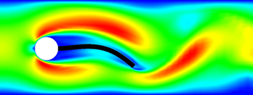
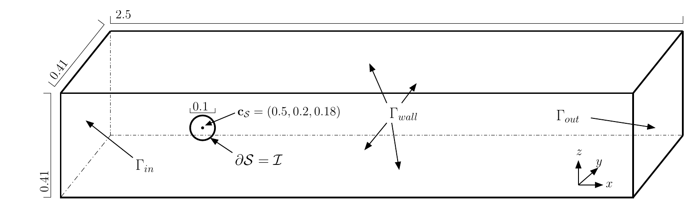

# Introduction

## What is a Benchmark

I haven't found a clear definition of what a benchmark is.
<!-- (maybe in contrast to a *numerical example*). -->
However, here is what I think makes a *numerical example* a
benchmark

1. **common acceptance as a benchmark** -- there are other publications that
   discuss the same setup
2. **practical relevance** -- either in applications or as a testing field for
   numerical algorithms
3. **reliable reference data** -- so that others can test their codes and
   methods against it 
   
## What is a Benchmark

> Basically, everything that would motivate a fellow researchers to use the
provided setup and data to *benchmark* their code.

## Why Benchmarks

Quantitative assessments, evaluate performance:

> We know that this computation *correct*, but how **efficient** is it?

Examples:

 * MOR Benchmark Collection
 * Dongarra

## Why Benchmarks 

Qualitive assessments, evaluate confidence:

> Are the computations **correct**?

Example: [Flow Past a Cylinder](www.featflow.de/en/benchmarks/cfdbenchmarking/flow/) by Sch&auml;fer&Turek

Note that:

> The more complex the model is, the more necessary are benchmarks **but** the more difficult are benchmark definitions.

## Fluid Structure Interaction

 * Changing domain.
 * Coupling of Models (and scales).

## Our Benchmark

---

### A freely rotating sphere with fixed center

 * The domain is fixed.
 * Can concentrate on the coupling of the models.
 * Accessible to standard CFD solvers.

---

### We address (2.) and (3.) of the benchmark criteria

 * Relevant as a testing field for algorithms and
 * reliable test data.

> (1.) General acceptance as a benchmark may come later.

# The model

## Verbose

 * A fluid flows through a channel with a sphere that can rotate freely.
 * The stresses at the sphere/fluid interface induce rotation.
 * The *no-slip* condition induces motion of the flow at the interface.

---

### The flow

\begin{equation*}
		\rho_f\left(\partial_t v + (v \cdot\nabla)v \right) - \nabla \cdot \sigma(v ,p) = 0, \quad \nabla\cdot v  = 0
\end{equation*}
with the stress-tensor
\begin{equation*}
	\sigma (v,p) = \rho _ f\nu\left( \nabla v+\nabla v^T \right) - p I
\end{equation*} 
and with standard boundary conditions and in particular
\begin{equation*}
    v = v_s \quad \text{on } \mathcal I
\end{equation*}
where $v_s$ is the solid's velocity at the fluid-solid interface.

---

### The rigid body

\begin{equation*}
    J\partial_t\omega = \mathbf T 
\end{equation*}

where $J$ is the body's moment of inertia and $\mathbf T$ is the total torque exerted onto the body by the fluid.
\begin{equation*}
	\mathbf T = \int_{\mathcal I} (\mathbf x-\mathbf c)\times \left( \sigma( v,p )\mathbf n \right) ds
\end{equation*}
with the body's centre of mass $\mathbf c$.

# Test Cases
## Setups 

 * 2D and 3D
 * stationary -- where $\mathbf T=0$ (low *Re*-number)
 * periodic -- a limit cycle (moderate *Re*-number)
 * time dependent -- a start-up period

## Characteristic outputs
### for the stationary case

| variable | definition |
| --- | -------- |
| $C_L$ | lift coefficient(s) | 
| $C_D$ | drag coefficient(s) | 
| $C_T$ | torque coefficient(s) | 
| $\Delta_p$ | pressure difference at the cylinder |
| ${\omega}^{ * }$ | dimensionless rotation |

---

### in the periodic case,

we used 

 * the *Strouhal number* to characterize the frequency
 * minima, maxima of $C_D$, $C_L$, $C_T$, and $\omega^{ * }$
 * and $\Delta_p(t^ * )$ -- at the middle of a period.

# Implementation

## Code Base

There were 5 independent implementations using established libraries:

 * Netgen/NGSolve
 * [FEniCS/dolfin](https://fenicsproject.org/download/)
 * Gascoigne
 * [SciPy](https://www.scipy.org)

## Algorithms

 * High-order and standard *Taylor-Hood* elements
 * High-order *divergence* free elements
 * Implicit/Explicit time integration   
 * Most critical: Evaluation of the boundary integrals

## Results

The reported (converged) characteristic outputs ly within certain confidence
intervals $\Delta_I$ 

| test case | relative size of $\Delta_I$ | critical value |
| ----- | ---- | --- |
| stationary-2D | $10^{-5}$ | $C_L$ |
| periodic-2D | $10^{-3}$ | $C_T$ |
| time-dep-2D | $10^{-3}$ | $C_L$ |
| stationary-3D | ($1$), $10^{-1}$ | $\omega^ { * }$ |

## Code Availability

Full data sets for the results as well as all implementations can be found at

> [DOI: 10.5281/zenodo.3253455](https://doi.org/10.5281/zenodo.3253455)

# Conclusion
## Conclusion

* Benchmarks are valuable for the assessment of numerical models

* The proposed benchmark may qualify as such because of
    * reliable data 
    * setup accessible to standard solvers

* I learned: Numerical analysis matters.

## References

---
nocite: |
    @WahRLHM19
...

